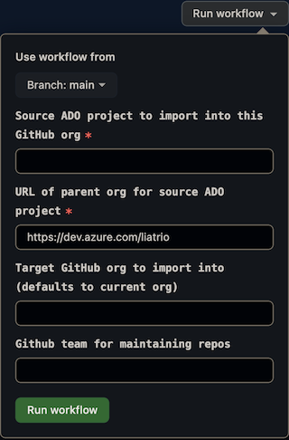

# Azure DevOps to GitHub migration helper

The workflow in this repository will migrate the Git repositories from an Azure DevOps project to GitHub.

## Prerequisites
##### Secrets
The following secrets should be set so that the workflow has access to them.
* `ADO_IMPORT_PAT` - Azure DevOps PAT with `read` access for repositories
* `GH_IMPORT_PAT` - GitHub PAT with full `repo` access

## Usage
Run the workflow in [`.github/workflows/import.yml`](.github/workflows/import.yml); provide the URL to the source Azure DevOps org and the name of the source project. 
By default, the workflow will use the org it's running in as the importation target, but this can be overridden when running the workflow.

The script will get a list of all the Git repositories in the source project, 
and will import them to the current GitHub org unless a repository with a matching name already exists.
